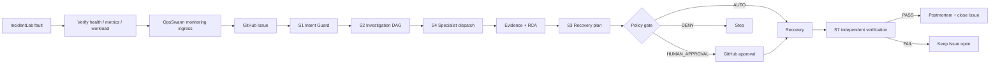

# OpsSwarm

> An agentic incident-response laboratory that turns verified runtime faults into auditable GitHub incidents, multi-agent investigation, governed recovery, and independent verification.

**Bundle:** 1.2.1 · **Runtime:** Docker Compose · **Agent runtime:** OpenClaw 2026.9.6 · **Default model:** MiniMax-M2.7-highspeed · **Scenarios:** C01-C12

OpsSwarm packages IncidentLab, the OpsSwarm orchestration service, OpenClaw specialist agents, simulated application services, Prometheus, and Alertmanager into one reproducible Docker environment. It is designed for incident-response demonstrations, controlled experiments, and evaluation of human-governed autonomous recovery.

## What it demonstrates

A fault is not treated as an incident until IncidentLab verifies a real runtime effect. After verification, OpsSwarm creates a GitHub Issue as the system of record and coordinates the response:



The default competition profile intentionally routes write actions through a human-approval checkpoint on GitHub.

## Core capabilities

- **Stateful fault injection** across five simulated services: `auth`, `order`, `inventory`, `payment`, and `booking-api`.
- **Twelve deterministic scenarios** covering crashes, bad deployments, error spikes, database faults, latency, saturation, telemetry loss, duplicate alerts, and false recovery.
- **Verified incident creation**: health, metrics, persisted state, and workload behavior are captured before orchestration starts.
- **GitHub system of record** for incident lifecycle, human approvals, state labels, and final resolution.
- **Seven OpenClaw agents** with role-specific workspaces and permissions.
- **S1-S8 OpsSwarm skills** packaged under `platform/openclaw/skills/`.
- **Policy-gated recovery** with `AUTO`, `HUMAN_APPROVAL`, and `DENY` decisions.
- **Run-bound recovery safety**: stale or cross-run recovery writes are rejected.
- **Independent verification** before an incident can reach `RESOLVED`.
- **Prometheus + Alertmanager** observability for the simulated environment.
- **Reproducible Docker deployment** on Windows or Linux without a host-installed OpenClaw runtime.

## Runtime components

| Component | Responsibility | Default host endpoint |
| --- | --- | --- |
| IncidentLab | Web UI, fault injection, evidence, recovery API | `http://localhost:8080` |
| OpsSwarm | Incident orchestration, GitHub control plane, policy and verification | `http://localhost:8088` |
| OpenClaw | Specialist agent runtime and S1-S8 skills | `127.0.0.1:18789` |
| Prometheus | Metrics collection and alert evaluation | `http://localhost:9090` |
| Alertmanager | Alert routing | `http://localhost:9093` |
| Simulated services | Stateful application targets | `8001-8005` |

OpenClaw is bound to loopback on the host by default. Inter-container communication uses the private Compose network.

## Quick start

### 1. Configure secrets

Linux/macOS shell:

```bash
cp .env.example .env
```

Windows PowerShell:

```powershell
Copy-Item .env.example .env
```

Fill at least:

```dotenv
GITHUB_REPO=ZINNODNTU/OpsSwarm-IncidentLab
GITHUB_TOKEN=...
OPENCLAW_GATEWAY_TOKEN=...
MINIMAX_API_KEY=...
```

Never commit the completed `.env` file.

### 2. Start the stack

Linux:

```bash
bash scripts/server-start.sh
```

Windows:

```bat
scripts\demo-start.cmd
```

Both launchers build the same Compose stack and wait for core health checks. The Linux server launcher additionally runs `scripts/server-smoke.sh`; the Windows launcher validates IncidentLab, OpsSwarm, and GitHub readiness before returning.

### 3. Run the preflight

```powershell
powershell.exe -NoProfile -ExecutionPolicy Bypass -File .\scripts\competition-preflight.ps1
```

Add `-FullTests` to include the Python test suite and packaged OpsSwarm compile check.

### 4. Run an end-to-end incident

```powershell
powershell.exe -NoProfile -ExecutionPolicy Bypass -File .\scripts\demo-e2e.ps1 -Scenario C03
```

When the run reaches `WAITING_APPROVAL`, post the approval command shown by the script to the GitHub Issue. To automate only that demo checkpoint:

```powershell
powershell.exe -NoProfile -ExecutionPolicy Bypass -File .\scripts\demo-e2e.ps1 -Scenario C03 -Approve
```

## Security and recovery boundaries

- Investigator and postmortem project mounts are read-only.
- The recovery responder receives the project read/write only for authorized repair work.
- The host `.env` is masked in every OpenClaw workspace.
- `runtime-data` is over-mounted read-only in the recovery workspace.
- The Docker socket is never mounted into OpenClaw.
- Runtime-state recovery is bound to the exact IncidentLab `run_id` encoded in `request_id`.
- Unknown recovery keys are rejected; derived health fields are verification-only.
- Source/config edits are permitted only through the recovery role after an OpsSwarm decision allows them.
- The GitHub webhook endpoint supports HMAC signature validation using `GITHUB_WEBHOOK_SECRET`.

See [Security](docs/SECURITY.md) for the full trust model and deployment guidance.

## Agent topology

| Agent | Primary role | Project access |
| --- | --- | --- |
| `opsswarm-incident-manager` | Coordination and incident control | Read-only |
| `opsswarm-observability-investigator` | Live health, metrics, evidence, S7 observation | Read-only |
| `opsswarm-application-investigator` | Application diagnosis | Read-only |
| `opsswarm-infrastructure-investigator` | Infrastructure diagnosis | Read-only |
| `opsswarm-database-investigator` | Database diagnosis | Read-only |
| `opsswarm-recovery-responder` | Authorized recovery/source repair | Read/write, evidence protected |
| `opsswarm-communications-postmortem` | Incident summary and postmortem | Read-only |

## Repository layout

```text
.
├── incidentlab/                  # IncidentLab API and web UI
├── services/                     # Stateful simulated target service
├── experiments/                  # C01-C12 scenario catalog
├── infrastructure/               # Prometheus and Alertmanager configuration
├── platform/
│   ├── opsswarm/                 # Packaged OpsSwarm runtime
│   └── openclaw/                 # OpenClaw image, config, agents and S1-S8 skills
├── scripts/                      # Start, stop, preflight, demo and cleanup tooling
├── tests/                        # IncidentLab regression tests
├── docs/                         # Project documentation
├── runtime-data/                 # Generated runtime state; not source
├── docker-compose.yml            # Unified local/server stack
├── .env.example                  # Safe configuration template
└── MANIFEST.json                 # Packaged runtime manifest
```

## Documentation

Start with [docs/README.md](docs/README.md).

| Guide | Purpose |
| --- | --- |
| [Architecture](docs/ARCHITECTURE.md) | Runtime topology, control flow, trust boundaries and evidence model |
| [Getting started](docs/GETTING_STARTED.md) | Installation, startup, validation and shutdown |
| [Configuration](docs/CONFIGURATION.md) | Environment variables, ports, polling and credentials |
| [Demo guide](docs/DEMO_GUIDE.md) | Recommended C03 end-to-end demonstration workflow |
| [Scenario catalog](docs/SCENARIOS.md) | C01-C12 fault matrix |
| [API reference](docs/API_REFERENCE.md) | IncidentLab and OpsSwarm HTTP endpoints |
| [Security](docs/SECURITY.md) | Permissions, secrets, recovery safety and deployment controls |
| [Troubleshooting](docs/TROUBLESHOOTING.md) | Common failures and diagnostic commands |

## Validation

For a ready-to-demo environment, the preflight verifies:

1. IncidentLab and OpsSwarm health.
2. Healthy baseline services.
3. GitHub issue creation readiness.
4. IncidentLab-to-OpsSwarm connectivity.
5. Containerized OpenClaw health.
6. Read-only investigator and writable recovery boundaries.
7. Presence and frontmatter of all S1-S8 skills.
8. A live specialist model call.
9. Optionally, the Python tests and OpsSwarm compile check.

A demo is considered successful only after the injected fault is verified, orchestration reaches a terminal state, recovery succeeds, and S7/IncidentLab verification confirms the service is restored.

## Development

```bash
python -m pip install -r requirements-dev.txt
python -m pytest -q
```

The packaged runtime targets Python 3.11+ for local development. The primary deployment path is Docker Compose.

## Upstream skill synchronization

The packaged S1-S8 skills are tracked against the upstream OpsSwarm repository. The exact synchronization record is stored in `platform/openclaw/skills/UPSTREAM-SYNC.json`.

The current manifest records upstream commit `1c712662e9093ef64a37522df800a0dfbcca9e81`, checked on 2026-09-26.

## Stop and clean

Linux:

```bash
bash scripts/server-stop.sh
```

Windows:

```bat
scripts\demo-stop.cmd
```

To also remove the persistent OpenClaw state volume:

```bash
bash scripts/server-stop.sh --purge-openclaw-state
```

Before packaging or publishing:

```bat
scripts\clean-repo.cmd
```

or:

```bash
bash scripts/clean-repo.sh
```
