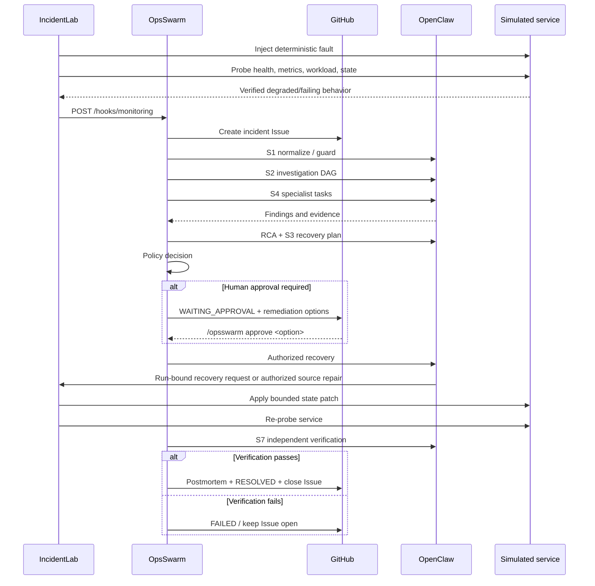
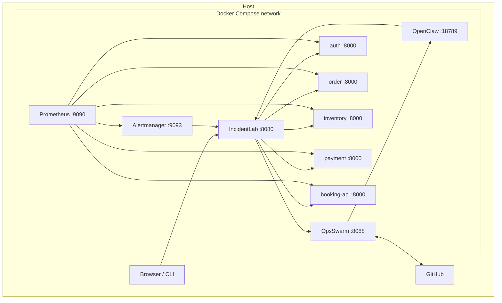

# OpsSwarm Architecture

## 1. Purpose

OpsSwarm is a reproducible incident-response laboratory that connects verified fault injection, GitHub incident tracking, multi-agent investigation, policy-controlled remediation, and independent recovery verification.

The repository runs the complete demonstration stack under Docker Compose:

- IncidentLab for deterministic faults, evidence, and recovery verification.
- OpsSwarm for orchestration, policy, GitHub workflow, RCA, recovery planning, and lifecycle state.
- OpenClaw for specialist agents and S1-S8 skills.
- Five stateful simulated services.
- Prometheus and Alertmanager for observability.

## 2. End-to-end control flow



## 3. Runtime topology



### Host exposure

| Service | Host binding | Notes |
| --- | --- | --- |
| IncidentLab | `${INCIDENTLAB_PORT:-8080}:8080` | UI and API |
| OpsSwarm | `${OPSSWARM_PORT:-8088}:8088` | Orchestration API |
| OpenClaw | `127.0.0.1:${OPENCLAW_GATEWAY_PORT:-18789}:18789` | Loopback-only by default |
| Simulated services | `8001-8005` by default | Debug/demo access |
| Prometheus | `${PROMETHEUS_PORT:-9090}:9090` | Observability |
| Alertmanager | `${ALERTMANAGER_PORT:-9093}:9093` | Alert inspection |

Inside Compose, services communicate by service DNS name, for example `http://openclaw:18789` and `http://incidentlab:8080`.

## 4. Component responsibilities

### IncidentLab

IncidentLab owns the simulated environment boundary:

- Loads C01-C12 scenarios.
- Captures a known-good baseline.
- Injects a fault into persisted service state.
- Proves the fault through health, metrics, workload, and state evidence.
- Dispatches only verified incidents to OpsSwarm.
- Stores run evidence under `runtime-data/incidentlab/`.
- Accepts bounded, run-specific recovery requests.
- Verifies recovery against baseline and workload behavior.

### OpsSwarm

OpsSwarm owns incident orchestration:

- Creates GitHub Issues from monitoring events.
- Uses GitHub as the incident system of record.
- Runs S1-S8 workflow logic.
- Dispatches specialist OpenClaw agents.
- Aggregates findings and produces RCA.
- Builds a recovery plan.
- Applies the configured policy gate.
- Processes human commands from GitHub comments.
- Executes authorized recovery.
- Performs final verification and closes only verified incidents.

### OpenClaw

OpenClaw is the agent execution runtime. The packaged default image is `ghcr.io/openclaw/openclaw:2026.9.6`.

All agents default to `minimax/MiniMax-M2.7-highspeed` and load S1-S8 skills from `/opt/opsswarm/skills`.

### Simulated services

The five stateful services share one implementation with service-specific defaults. Their persisted state lives under `runtime-data/service-state/<service>/state.json`, so a container restart alone does not silently erase a fault.

## 5. Agent isolation model

| Agent | Source mount | Write tools |
| --- | --- | --- |
| Incident manager | Read-only | Denied |
| Observability investigator | Read-only | Denied |
| Application investigator | Read-only | Denied |
| Infrastructure investigator | Read-only | Denied |
| Database investigator | Read-only | Denied |
| Recovery responder | Read/write | Allowed |
| Communications/postmortem | Read-only | Denied |

Additional controls:

- The real repository `.env` is hidden by an over-mounted `platform/openclaw/blocked.env`.
- `runtime-data` is read-only inside the recovery responder's project view.
- The Docker socket is not exposed to OpenClaw.
- Investigators cannot modify project source.
- The recovery role can modify source only after an OpsSwarm-approved recovery decision.

The observability investigator retains execution capability for live read-only health/state checks, but its project filesystem remains read-only.

## 6. Recovery model

### 6.1 Runtime-state recovery

For stateful scenario faults, the recovery responder calls:

```text
POST /api/recovery/{service}
```

The request must include a `request_id` containing the exact target IncidentLab `run_id`. IncidentLab rejects missing/unknown run IDs, service mismatches, non-recoverable runs, stale requests, and unsupported state keys.

Derived health/status fields cannot be written as recovery state.

### 6.2 Source/config recovery

A bounded source/config edit is available only to the recovery responder when the approved plan explicitly requires it. Python services run with reload enabled so authorized edits can take effect without exposing the Docker daemon.

## 7. Evidence model

Each IncidentLab run captures a timeline containing:

1. Baseline health, metrics, workload, and persisted state.
2. Fault injection.
3. Verified fault effect.
4. Orchestration/GitHub linkage.
5. Recovery request and applied patch.
6. Post-recovery health, metrics, workload, and persisted state.
7. Verification result.

OpsSwarm stores its run/evidence state under `runtime-data/opsswarm/`.

The incident payload also carries an immutable baseline/fault snapshot so agents retain authoritative evidence if a private live endpoint is temporarily unavailable.

## 8. Policy gate

The packaged demo policy in `platform/opsswarm/config/incidentlab-demo.yaml` is:

| Action class | Default decision |
| --- | --- |
| Read | `AUTO` |
| Safe write | `HUMAN_APPROVAL` |
| Risky write | `HUMAN_APPROVAL` |
| Destructive | `DENY` |

The demo profile intentionally makes the write checkpoint visible to reviewers.

## 9. GitHub control plane

OpsSwarm supports:

- `POST /webhooks/github` for signed GitHub webhook delivery.
- Polling fallback controlled by `OPSWARM_GITHUB_POLL_ENABLED` and `OPSWARM_GITHUB_POLL_SECONDS`.

A human approval comment uses:

```text
/opsswarm approve <option-id>
```

Approval permission is enforced by the configured GitHub repository permission rules.

## 10. Verification and terminal state

A successful write is not sufficient to close an incident. OpsSwarm must enter verification and obtain an independent S7 result. IncidentLab also verifies live recovery against the baseline.

- `RESOLVED`: recovery completed and verification passed.
- `FAILED`: recovery/verification failed; the Issue remains open.
- `ABORTED`: the run was intentionally stopped by control-plane logic.

## 11. Observability

Prometheus scrapes the simulator services and evaluates `infrastructure/alerts.yml`. Alertmanager routes alerts to IncidentLab's normalized monitoring boundary.

## 12. Design invariants

1. Incident orchestration starts only after a verified fault path.
2. Investigation roles remain read-only.
3. Recovery writes are policy-gated.
4. Runtime recovery is bound to one IncidentLab run.
5. Recovery cannot directly edit evidence.
6. OpenClaw never receives the Docker socket.
7. Resolution requires verification.
8. Generated runtime state remains separate from source.
